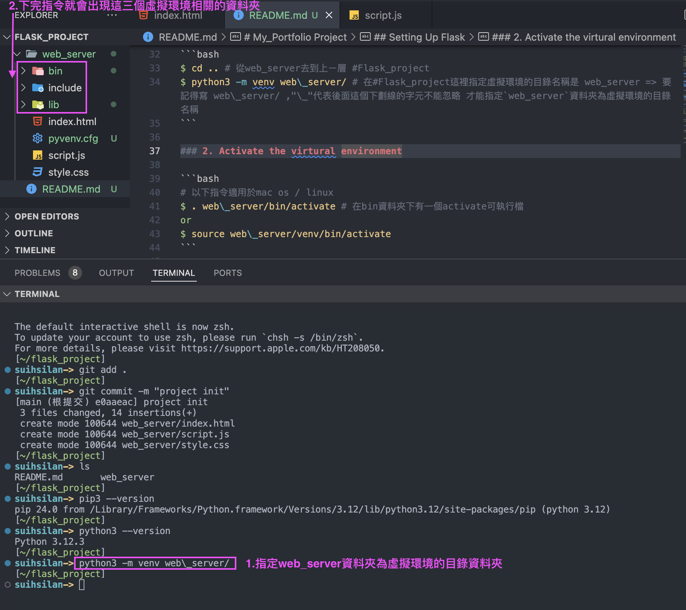
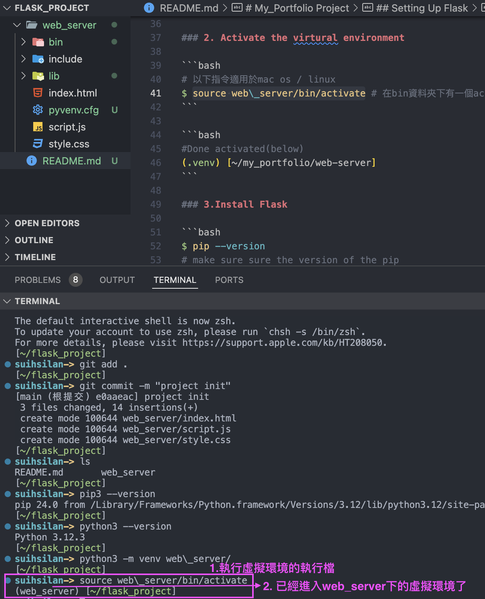
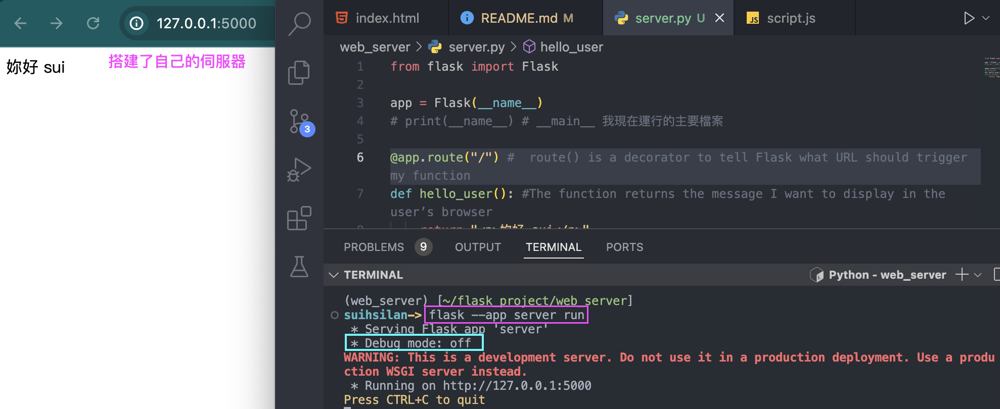
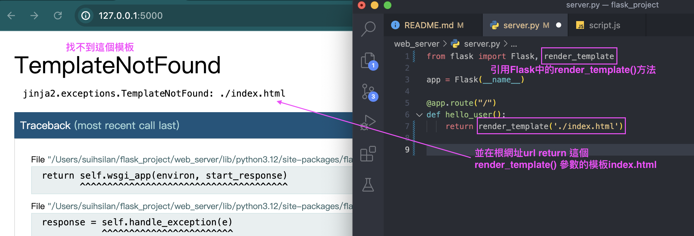
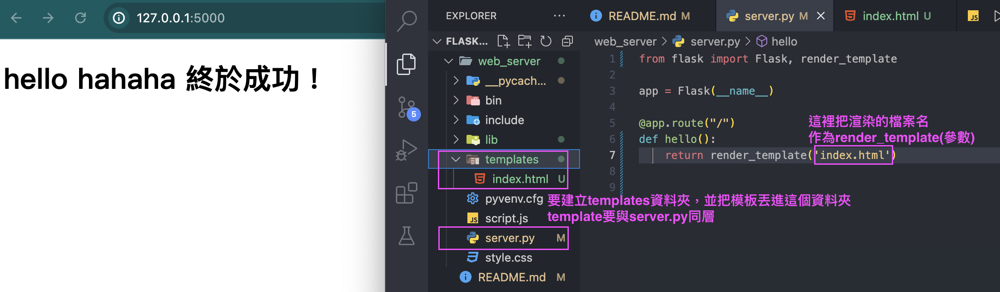
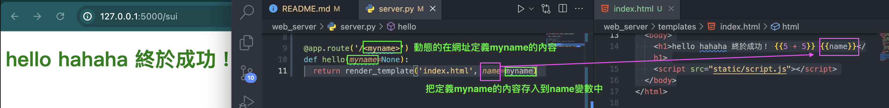
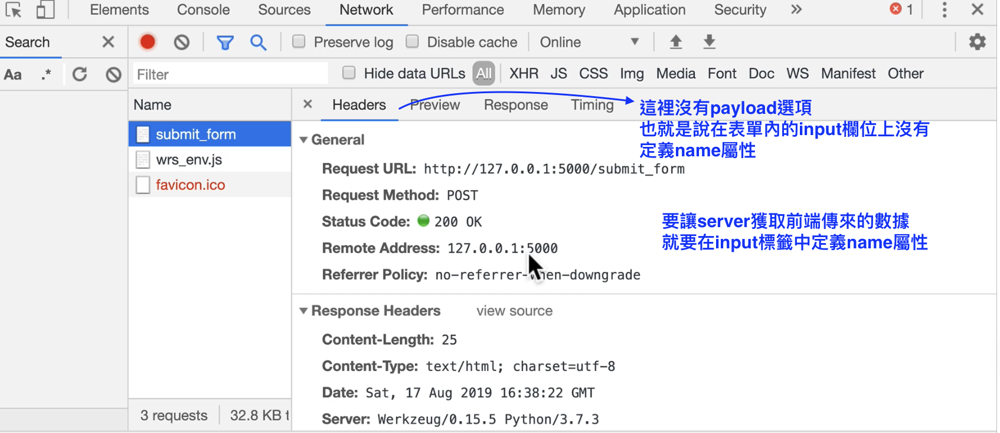
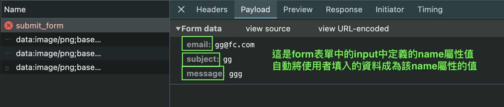

# My_Portfolio Project

## 本專案使用 mac os

- 本專案是我使用 Flask 框架搭建伺服器來做的履歷專案，內容有些也是在構建過程中去閱讀 Flask 官方文件所寫的筆記

## before start: init empty repository in project

```bash
$ mkdir flask_project # 建立專案資料夾
$ cd flask_project # 進入該專案資料夾
$ git init # 在本地數據庫-建立空儲存庫

$ mkdir web_server
$ cd web_server
$ touch index.html style.css script.js;code .
```

## Setting Up Flask

### 1. Create an virtural environment:

#### 常見做法：

```bash
$ python3 -m venv .venv # =>通常作法
# `-m` 參數告訴 Python 執行一個模組module
# `venv` 用於創建虛擬環境的內置模組
# 指定虛擬環境的目錄名稱`.venv`
```

#### 我這次做法是：

```bash
$ cd .. # 從web_server去到上ㄧ層 #Flask_project
$ python3 -m venv web\_server/ # 在#Flask_project這裡指定虛擬環境的目錄名稱是 web_server => 要記得寫 web\_server/ ,"\_"代表後面這個下劃線的字元不能忽略 才能指定`web_server`資料夾為虛擬環境的目錄名稱
```



### 2. Activate the virtural environment

```bash
# 以下指令適用於mac os / linux
$ source web\_server/bin/activate # 在bin資料夾下有一個activate可執行檔
```

```bash
#Done activated(below)
(web_server) [~/flask_project]
```



### 3.Install Flask

```bash
$ pip3 --version
# make sure sure the version of the pip3
```

```bash
$ pip3 install Flask # installing Flask
```

### 4.Building A Flask Server

## A Minimal Application

### create a new python file(server.py) in web_server directory

```bash
$ cd web_server
$ touch server.py
```

- 在 server.py 檔案中寫以下程式碼：

```python
from flask import Flask # 導入Flask類(說明書) -> WSGI 應用程式

app = Flask(__name__) # 透過Flask類說明書 -> 創建app物件

@app.route("/") # route() is a decorator to tell Flask what URL should trigger my function(request this route -> to run below the function -> return something)
def hello_user(): #The function returns the message I want to display in the user’s browser
    return "<p>妳好 sui/p>"
    #The default content type is HTML
```

### To run this application

```bash
$ flask --app server run # 是告訴flask 運行server.py這個應用程式

#舊版
$ export FLASK_APP=server
$ flask run
```



#### Debug Mode

- 在本地端運行伺服器時，可以看到訊息寫：
  - Debug mode: off
- 可以這樣將調試器打開(加入副指令 --debug):

```bash
$ flask --app server run --debug
#舊版 除錯模式
$ export FLASK_APP=development
$ flask run

```

> [!WARNING]
> The debugger allows executing arbitrary Python code from the browser. It is protected by a pin, but still represents a major security risk. Do not run the development server or debugger in a production environment.

## Try to visit some routes

### route() decorator will bind the function to return some specific vale

```python
@app.route('/blog')
def blog():
    return 'This is my first blog'

@app.route('/blog/ca2020/job')
def blog2():
    return 'This is my first job!!!'
```

## Rendering Templates



- To render a template,use the render_template() method

  - this render_template() allow me to send the HTML file
  - how it works?

    - Flask will look for templates file in the "templates" folder
    - if u application is a module, this folder is next to that module (my server.py is a module)=> this way
    - if it’s a package it’s actually inside your package

```
/web_server (創建的虛擬環境)
  /server.py  (模組)
  /templates (templates資料夾＝>一定要創建)
    /index.html (想要渲染在瀏覽器的html內容)
```



```python
@app.route("/aboutMe.html")
def aboutMe():
    return render_template('aboutMe.html')
```

## Static Files

- Dynamic web applications also need "Static Files" it's where the CSS and JavaScript files are coming from.
- my flask web server is configured to serve them
- but during development, Flask can do that as well.
- Just create a folder called "static" in your package or next to your module and it will be available at /static on the application

### what to do ?

- at first, create directory named "static" just below the web_server/ also besides my server.py module
- second, I move the "web_server/script.js" and "web_server/style.css" to :

  - web_server/static/script.js
  - web_server/static/style.css

- Don't forget to fix the link about CSS and JS in index.html file

## Adding a favicon

- favicon is an icon used by browsers for tabs and bookmarks

### how to add a favicon to a Flask application

- prepare icon:

  - icon size: 16 × 16 pixels
  - in the ICO file format
  - Put the icon in static directory as favicon.ico

- get browsers to find your icon:
  - to generate URLs for static files, use the special 'static' endpoint name
  ```html
  url_for('static', filename='style.css')
  ```
  - add a link tag in HTML file
  ```html
  <link
    rel="shortcut icon"
    href="{{ url_for('static', filename='favicon.ico') }}"
  />
  ```

## Templating Engine & Variable Rules

### Templating Engine

- we can use flask to build things dynamiclly.
- if I do in index.html like this:

```html
<body>
  {{4 + 5}}
</body>
```

- flask 會當作是表達式(python code) =>運算結果
- jinja 是 flask 預設的 Template Engine

### Variable Rules

- 如何動態的新增名字在 url 中並且能夠動態的連動改變在 html 顯示的變數內容：

```python
@app.route('/<myname>')
def hello(myname=None):
  return render_template('index.html', name=myname)
```

- html 檔案要這樣設定：

```html
<body>
  <h1>hello {{name}}</h1>
</body>
```

- 還可以指定變數參數的類型：

```python
@app.route('/<myname>/<int:post_id>')
def hello(myname=None, post_id=None):
  return render_template('index.html', name=myname, post_id=post_id)
```

- html 加入變數:

```html
<body>
  <h1>hello hahaha 終於成功！ {{5 + 5}} {{name}} {{post_id}}</h1>
  <script src="static/script.js"></script>
</body>
```



## dynamic => show parameter Url

```python
@app.route('/<資料型態:參數名>')
def html_page(page_name):
    return render_template(page_name)
```

- 在 Flask 專案中，使用 `@app.route()` 裝飾器來定義路由，其中的`<string: page_name>` 部分表示一個動態路由，它允許我們捕捉 URL 中的特定值並將其傳遞給相應的視圖函數
  - `@app.route('/<string:page_name>')` 表示當使用者訪問的 URL 形如 /something 時（其中 something 可以是任何字串），Flask 將會調用這個 html_page 函數
  - `<string:page_name>` 是一個動態部分，代表我們希望從 URL 中捕捉一個字串，並將其作為 page_name 的參數傳遞給 html_page 函數
  - `def html_page(page_name):` 定義了這個視圖函數，它接受 page_name 作為參數
  - `render_template(page_name)` 則是 Flask 提供的函數，它會根據傳入的模板名稱 page_name 去渲染相應的 HTML 模板文件
  - 如果有一個名為 `about.html` 的模板文件位於 `templates` 文件夾下，當用戶訪問 `/about` 時，Flask 將會渲染 `about.html` 並將其呈現給用戶

## 定義模板共用架構 base.html

- 在 html 頁面中會發現多數的內容有些重複，
- 因此，在 Flask 應用程式中，base.html 是一個用來定義整個網站共用結構和樣式的基本模板。這個模板會被其他具體頁面的模板所擴展（extend），從而實現網站的統一外觀和布局
- `Flask App`

## Request and Response :如何傳送表單給伺服器 以及 伺服器 接收 resquest 讀取資料

### 解釋一下 request 請求

- 後端開發中，特別是使用 Flask 框架時，可以通過定義路由（也稱為端點）來提供 API

  - 這些路由可以處理不同的 HTTP 請求方法（如 GET、POST、PUT、DELETE 等），並根據請求進行相應的處理和回應
  - 在 contact me 頁面中有表單送出的功能，那若要開啟這個網路請求的功能，我需要在`後端開api端點`來接收`前端使用者透過request發送過來的請求`

- The Request Object
  - 當前請求的方法可以透過`method屬性`來定義
  - 要從 POST or PUT 請求中傳輸的數據取得資料可，則可以使用`form屬性`
  - 匯入 request

```python=
from flask import request
# 從flask模組中匯入
```

- 首先，在 server.py 中加入可以讓前端提交表單的 API 端點(創建路由)

```python=
# 定義API端點
@app.route('/submit_form', methods=['POST', 'GET'])
def submit_form(): # 定義回傳的內容
   return '表單已成功提交到伺服器囉！'
```

- `get`方法是前端/瀏覽器那方想要跟我這端伺服器發送資料給前端
- `post`方法是前端/瀏覽器那方想要跟我這端伺服器儲存資料
- 上面的路由要怎麼去調用呢？從不會直接從前端來調用這個方法
  - 意即：使用者按下 發送 按鈕 要如何把寫好的表單資訊 傳送到後端
  - 到表單的頁面中，當使用者填好表單，他會按下『發送』按鈕
  - 從『發送』標籤往父層尋找`form`元素來看結構

```html=
<button type="submit" class="btn btn-default btn-lg">Send</button>
<form action="submit_form" method="post" class="reveal-content">
```

- 意即：使用者按下 發送 按鈕 要如何把寫好的表單資訊 傳送到後端

  - HTML form 表單的 `action 屬性`指定了表單提交的目標 URL
  - 這裡設為 "/submit_form"，對應後端的路由
  - `method="post"` 指定使用 POST 方法提交表單，這與後端路由的 methods=['POST'] 相對應
  - 當使用者點擊 "Send" 按鈕時，表單會自動提交到指定的 URL/API 端點(action `/submit_form`b 然後會運行在伺服器定義的 submit_form()函式)
  - 後端的 @app.route('/submit_form', methods=['POST']) 裝飾器定義了接收這個表單提交的路由
  - submit_form() 函數將處理接收到的表單數據
  - 如需進一步處理表單數據，您可以在 submit_form() 函數中添加相關邏輯，例如:

  ```python=
  from flask import request

  @app.route('/submit_form', methods=['POST'])
  def submit_form():
      name = request.form.get('name')
      email = request.form.get('email')
      # 處理數據...
      return f'表單已成功提交到伺服器囉！收到的姓名: {name}, 郵箱: {email}'
  ```

> [!important]  
> 在這種情況下，name 屬性是必須的。沒有 name 屬性的 input 元素的值不會被提交到服務器



- 傳送表單後，在 dev tool 中的 network 中看到 submit_form 請求的資料 - 展開後，可以看到 status_code - `Content-Type:
application/x-www-form-urlencoded` => 這正是在 HTML 中使用表單標籤時，可以發送的標準數據類別



### 伺服器接收 request 如何讀取前端傳送的表單資料？

- 在 flask 文件中 request 有提供.form 的屬性：
- 另外還有將前端傳送過來的表單資料`name屬性：input值` 組成{字典} 使用.to_dict()

```python=
@app.route('/login', methods=['POST', 'GET'])
def login():
    if request.method == 'POST':
        if valid_login(request.form['username'], #這裡
                       request.form['password']): #這裡
            return log_the_user_in(request.form['username'])
        else:
            error = 'Invalid username/password'
    # the code below is executed if the request method
    # was GET or the credentials were invalid
    return render_template('login.html', error=error)
```

### 後端讀取前端傳送的表單資料 並回傳一個感謝頁面給前端

```python=
@app.route('/submit_form', methods=['POST', 'GET'])
def submit_form():
    if request.method == 'POST':
      data = request.form.to_dict()
      print(data)
      return '表單已成功提交了！'
    else:
      return 'something went wrong@@'

# 若成功提交會出現data在終端機顯示{'email': 'gg@fc.com', 'subject': '我是前端 我想傳送數據給你啊', 'message': '你好啊'}
```

- 可以在定義一個 html 頁面類似感謝信

  - 需要使用重新定向的方法 flask 有提供

  ```python=
  from flask import redirect
  @app.route('/submit_form', methods=['POST', 'GET'])
  def submit_form():
    if request.method == 'POST':
        data = request.form.to_dict()
        print(data)
        return redirect('/thankyou.html')
  ```

  - 因為感謝信的結構和 contactme 頁面一致，只要把 form 結構挖出來替換成表單提交後的 重新定向頁面內容即可！
  - 記得要在 contact.html 的 form 外層包 ` `

  ```html=
  <!-- 這裡的結構跟 contact.html 一樣 只是要挖出form 改作一些提示文字就是說表單已傳輸成功-->
  
  
  <div>我們已收到你的表單，感謝！後續再與你保持聯繫！</div>
  

  ```

  > [!important]
  > 在 Flask 中，從一個路由重定向到另一個路由時，不能直接傳遞數據

## reference

- 詳請可見[Flask](https://flask.palletsprojects.com/en/3.0.x/installation/)
- 詳請可見[venv Documentation](https://docs.python.org/3/library/venv.html)

---

## 每次啟動程序流程：

- vscode 打開專案

  - 啟動虛擬伺服器()

  ```bash=
    $source web\_server/bin/activate
  ```

  - 終端機 cd 到專案建立的虛擬伺服器環境 資料夾

  ```bash=
    $cd web_server
  ```

  - 啟動 Flask 應用程式

  ```bash=
    $flask --app server run
  ```
